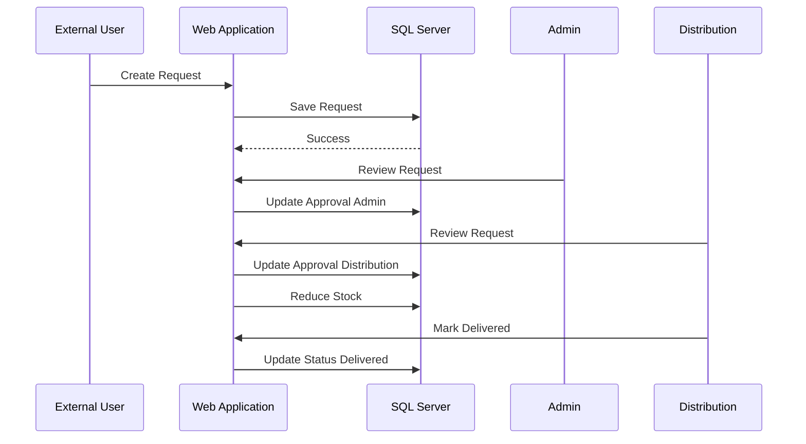
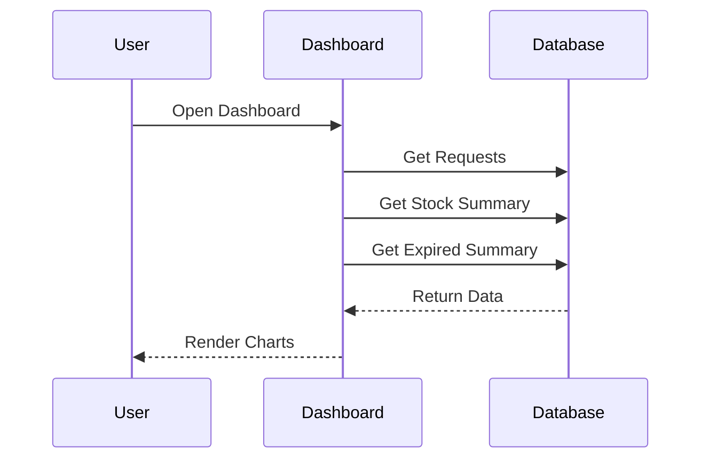

# Product Requirements Document (PRD)
# Medical Inventory System

## 1. Overview

### Background
Perusahaan ABC membutuhkan aplikasi **Medical Inventory System** yang berfungsi sebagai:
1. Portal transaksi permintaan obat antara External User dengan Perusahaan ABC.
2. Sistem monitoring persediaan obat.
3. Sistem approval distribusi obat.
4. Dashboard monitoring stok, request, dan masa berlaku obat.

### Objective
- Mempermudah proses permintaan obat.
- Menyediakan proses approval berlapis.
- Mengontrol stok obat secara real-time.
- Memantau obat yang mendekati masa expired.
- Menyediakan dashboard analitik untuk Admin dan User Distribution.

### Success Metrics
- Seluruh request obat tercatat dalam sistem.
- Approval dapat dilakukan secara digital.
- Stok berkurang otomatis setelah request fully approved.
- Dashboard menampilkan data stok dan expired secara real-time.

---

# 2. Requirements

## 2.1 Functional Requirements

### FR-001 Authentication & Authorization
Sistem harus menyediakan:
- Login
- Logout
- Session Management
- Role Based Access Control (RBAC)

Role:
1. Admin
2. User Distribution
3. External User

### FR-002 Master Data Obat

Admin dapat:
- Menambah obat
- Mengubah data obat
- Menghapus obat
- Melihat daftar obat

Data obat:

| Field | Type |
|---------|---------|
| Nama Obat | String |
| Stok Obat | Integer |
| Harga Obat | Decimal |
| Expired Date | Date |
| Created Date | Datetime |
| Updated Date | Datetime |

### FR-003 Request Obat

External User dapat:
- Melihat daftar obat
- Memilih obat
- Menginput jumlah request
- Mengirim request

Validasi:
- Jumlah request > 0
- Tidak boleh melebihi stok tersedia

### FR-004 Approval Request

Flow Approval:

External User
→ Admin Approval
→ Distribution Approval
→ Ready for Delivery

Status Request:

- Draft
- Submitted
- Approved By Admin
- Rejected By Admin
- Approved By Distribution
- Rejected By Distribution
- Fully Approved
- Delivered

### FR-005 Inventory Monitoring

Admin dan Distribution dapat melihat:

- Total stok
- Stok rendah
- Stok aman
- Stok habis

Rule:

Low Stock:
```
Stock < 10
```

Normal Stock:
```
Stock >= 10
```

### FR-006 Expired Monitoring

Kategori:

Mendekati Expired:
```
Expired Date <= H+7
```

Masih Aman:
```
Expired Date > H+7
```

### FR-007 Dashboard

Dashboard menampilkan:

#### Widget 1
List request terbaru beserta status

#### Widget 2
Grafik Perbandingan Stok

Kategori:
- Low Stock (<10)
- Available Stock (>=10)

#### Widget 3
Grafik Monitoring Expired

Kategori:
- Near Expired
- Safe

---

# 3. Core Features

## Feature 1 - User Management

Capability:
- Login
- Role Management
- Permission Management

## Feature 2 - Inventory Management

Capability:
- CRUD Obat
- Tracking Stok
- Tracking Expired Date

## Feature 3 - Request Management

Capability:
- Create Request
- Approval Workflow
- Status Tracking

## Feature 4 - Distribution Management

Capability:
- Approval Distribusi
- Delivery Tracking

## Feature 5 - Dashboard & Reporting

Capability:
- Stock Monitoring
- Expired Monitoring
- Request Monitoring

---

# 4. User Flow

## 4.1 External User Flow

1. Login
2. Melihat daftar obat
3. Memilih obat
4. Input jumlah request
5. Submit request
6. Menunggu approval Admin
7. Menunggu approval Distribution
8. Menerima notifikasi request approved
9. Barang dikirim

Flow:

External User
→ Create Request
→ Submitted
→ Waiting Approval

---

## 4.2 Admin Flow

1. Login
2. Kelola data obat
3. Monitoring dashboard
4. Review request masuk
5. Approve / Reject request
6. Monitoring stok

Flow:

Admin
→ Review Request
→ Approve / Reject
→ Forward to Distribution

---

## 4.3 User Distribution Flow

1. Login
2. Melihat request yang sudah disetujui Admin
3. Approve / Reject
4. Konfirmasi pengiriman
5. Update status Delivered

Flow:

Distribution
→ Review Request
→ Approve
→ Delivery
→ Delivered

---

# 5. System Architecture

## High Level Architecture

```text
+-------------------+
| Responsive Web UI |
+---------+---------+
          |
          v
+-------------------+
| ASP.NET Core MVC  |
+---------+---------+
          |
          v
+-------------------+
| Service Layer     |
+---------+---------+
          |
          v
+-------------------+
| Repository Layer  |
+---------+---------+
          |
          v
+-------------------+
| SQL Server DB     |
+-------------------+
```

## Sequence Diagram - Request Obat



## Sequence Diagram - Dashboard



---

# 6. Database Schema

## users

| Column | Type |
|----------|----------|
| Id | BIGINT |
| FullName | VARCHAR(150) |
| Email | VARCHAR(200) |
| PasswordHash | VARCHAR(500) |
| RoleId | BIGINT |
| IsActive | BIT |
| CreatedAt | DATETIME |

## roles

| Column | Type |
|----------|----------|
| Id | BIGINT |
| RoleName | VARCHAR(100) |

## medicines

| Column | Type |
|----------|----------|
| Id | BIGINT |
| MedicineName | VARCHAR(200) |
| StockQty | INT |
| Price | DECIMAL(18,2) |
| ExpiredDate | DATE |
| CreatedAt | DATETIME |
| UpdatedAt | DATETIME |

## requests

| Column | Type |
|----------|----------|
| Id | BIGINT |
| RequestNumber | VARCHAR(50) |
| UserId | BIGINT |
| Status | VARCHAR(50) |
| RequestDate | DATETIME |
| AdminApprovedAt | DATETIME |
| DistributionApprovedAt | DATETIME |
| DeliveredAt | DATETIME |

## request_details

| Column | Type |
|----------|----------|
| Id | BIGINT |
| RequestId | BIGINT |
| MedicineId | BIGINT |
| Qty | INT |
| Price | DECIMAL(18,2) |

## approval_logs

| Column | Type |
|----------|----------|
| Id | BIGINT |
| RequestId | BIGINT |
| ActionBy | BIGINT |
| ActionType | VARCHAR(50) |
| Remarks | VARCHAR(500) |
| ActionDate | DATETIME |

---

# 7. SQL Server Database Script

```sql
CREATE TABLE Roles (
    Id BIGINT IDENTITY(1,1) PRIMARY KEY,
    RoleName VARCHAR(100) NOT NULL
);

CREATE TABLE Users (
    Id BIGINT IDENTITY(1,1) PRIMARY KEY,
    FullName VARCHAR(150) NOT NULL,
    Email VARCHAR(200) NOT NULL UNIQUE,
    PasswordHash VARCHAR(500) NOT NULL,
    RoleId BIGINT NOT NULL,
    IsActive BIT DEFAULT 1,
    CreatedAt DATETIME DEFAULT GETDATE(),
    FOREIGN KEY(RoleId) REFERENCES Roles(Id)
);

CREATE TABLE Medicines (
    Id BIGINT IDENTITY(1,1) PRIMARY KEY,
    MedicineName VARCHAR(200) NOT NULL,
    StockQty INT NOT NULL,
    Price DECIMAL(18,2) NOT NULL,
    ExpiredDate DATE NOT NULL,
    CreatedAt DATETIME DEFAULT GETDATE(),
    UpdatedAt DATETIME NULL
);

CREATE TABLE Requests (
    Id BIGINT IDENTITY(1,1) PRIMARY KEY,
    RequestNumber VARCHAR(50) NOT NULL,
    UserId BIGINT NOT NULL,
    Status VARCHAR(50) NOT NULL,
    RequestDate DATETIME DEFAULT GETDATE(),
    AdminApprovedAt DATETIME NULL,
    DistributionApprovedAt DATETIME NULL,
    DeliveredAt DATETIME NULL,
    FOREIGN KEY(UserId) REFERENCES Users(Id)
);

CREATE TABLE RequestDetails (
    Id BIGINT IDENTITY(1,1) PRIMARY KEY,
    RequestId BIGINT NOT NULL,
    MedicineId BIGINT NOT NULL,
    Qty INT NOT NULL,
    Price DECIMAL(18,2) NOT NULL,
    FOREIGN KEY(RequestId) REFERENCES Requests(Id),
    FOREIGN KEY(MedicineId) REFERENCES Medicines(Id)
);

CREATE TABLE ApprovalLogs (
    Id BIGINT IDENTITY(1,1) PRIMARY KEY,
    RequestId BIGINT NOT NULL,
    ActionBy BIGINT NOT NULL,
    ActionType VARCHAR(50) NOT NULL,
    Remarks VARCHAR(500),
    ActionDate DATETIME DEFAULT GETDATE(),
    FOREIGN KEY(RequestId) REFERENCES Requests(Id),
    FOREIGN KEY(ActionBy) REFERENCES Users(Id)
);
```

---

# 8. Tech Stack

## Frontend
- ASP.NET Core MVC Razor
- Bootstrap 5
- HTML5
- CSS3
- JavaScript
- jQuery

## Backend
- ASP.NET Core MVC
- C#
- Repository Pattern
- Service Layer Pattern

## Database
- SQL Server
- Stored Procedure
- SQL Indexing

## Authentication
- ASP.NET Identity
- Cookie Authentication
- Role Based Access Control

## Chart Library
- Highcharts.js (Recommended)
atau
- Chart.js

## DevOps
- IIS Hosting
- Azure App Service (Optional)
- Git
- GitHub

## Security
- Password Hashing
- CSRF Protection
- HTTPS
- Input Validation

## Logging
- Serilog
- SQL Logging
- File Logging

---

# 9. Folder Structure

Struktur folder project menggunakan pendekatan **Basic MVC** yang sesuai dengan skala project ini.

```
InitialSetupMVC/
│
├── InitialSetupMVC.csproj
├── InitialSetupMVC.csproj.user
├── Program.cs
├── appsettings.json
├── appsettings.Development.json
├── setup.sql
├── Medical_Inventory_System_PRD.md
│
├── Controllers/
│   ├── ApprovalController.cs
│   ├── AuthController.cs
│   ├── DashboardController.cs
│   ├── MedicineController.cs
│   └── RequestController.cs
│
├── Data/
│   └── DbConnection.cs
│
├── Models/
│   ├── ApprovalLog.cs
│   ├── DashboardViewModel.cs
│   ├── ErrorViewModel.cs
│   ├── Medicine.cs
│   ├── Request.cs
│   ├── RequestDetail.cs
│   └── User.cs
│
├── Repositories/
│   ├── MedicineRepository.cs
│   ├── RequestRepository.cs
│   └── UserRepository.cs
│
├── Services/
│   ├── ApprovalService.cs
│   ├── AuthHelper.cs
│   ├── AuthService.cs
│   ├── DashboardService.cs
│   ├── MedicineService.cs
│   └── RequestService.cs
│
├── Views/
│   ├── Approval/
│   │   └── Index.cshtml
│   ├── Auth/
│   │   └── Login.cshtml
│   ├── Dashboard/
│   │   └── Index.cshtml
│   ├── Medicine/
│   │   └── Index.cshtml
│   ├── Request/
│   │   ├── Create.cshtml
│   │   └── Index.cshtml
│   ├── Shared/
│   │   ├── Error.cshtml
│   │   ├── _Layout.cshtml
│   │   ├── _Layout.cshtml.css
│   │   └── _ValidationScriptsPartial.cshtml
│   ├── _ViewImports.cshtml
│   └── _ViewStart.cshtml
│
└── wwwroot/
    ├── css/
    │   └── site.css
    ├── js/
    │   └── site.js
    └── lib/
        ├── bootstrap/
        ├── jquery/
        ├── jquery-validation/
        └── jquery-validation-unobtrusive/
```

## Alur Dependency

```
Controller → Service → Repository → DB
```
